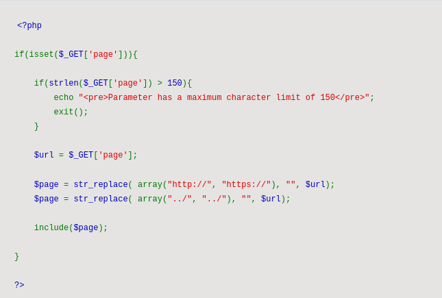
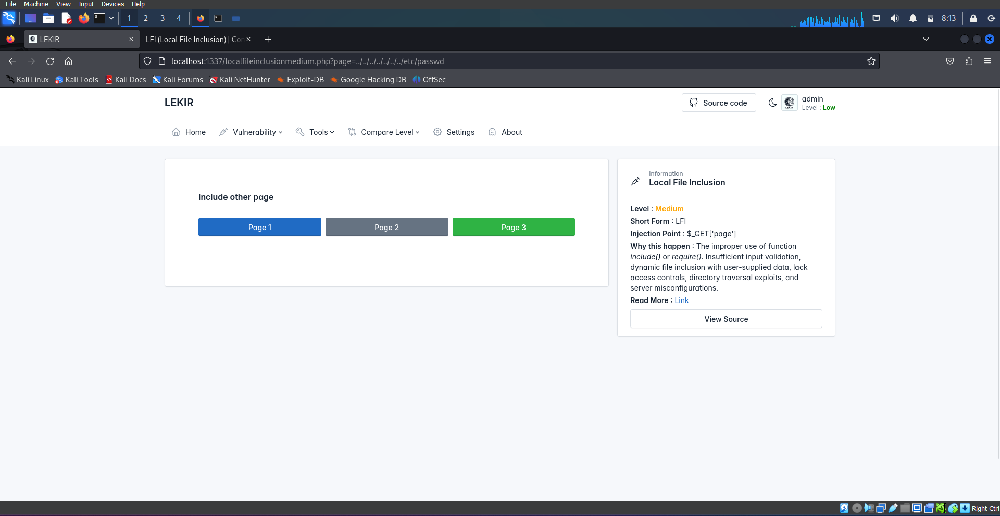
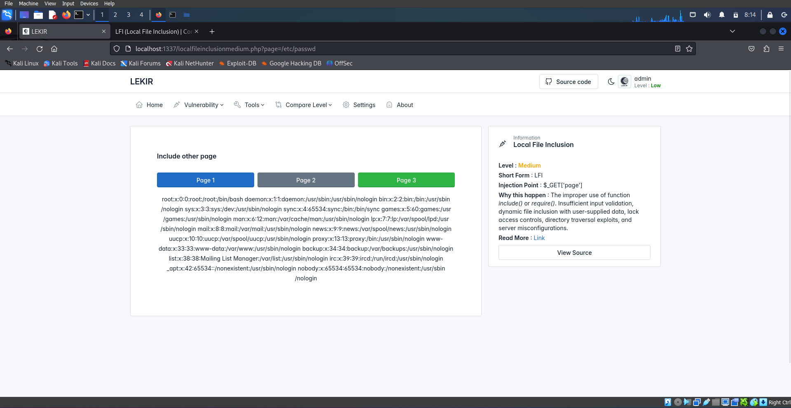
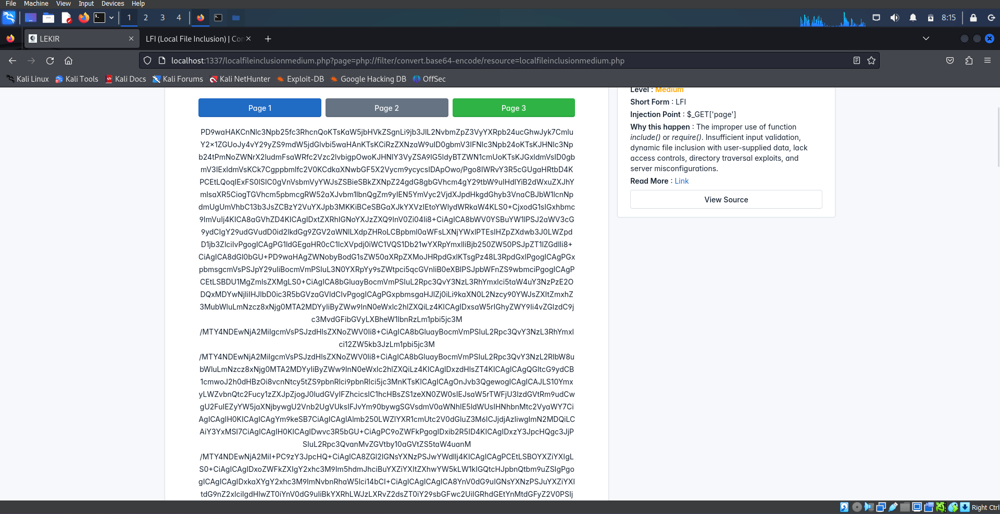
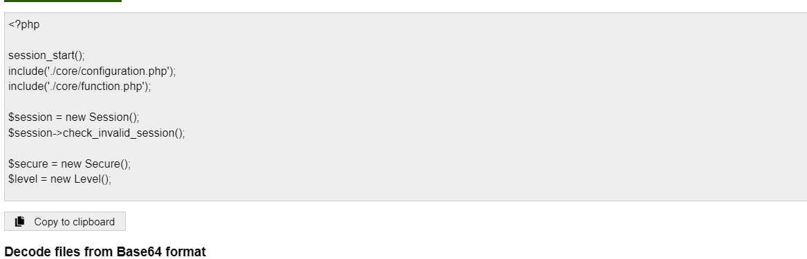

# What is a Local File Inclusion (LFI) vulnerability?
Local File Inclusion (LFI) is a type of vulnerability found in web applications where an attacker can manipulate a web application's file inclusion functionality to include files from the server's local filesystem.
  
The following is an example of PHP code vulnerable to local file inclusion:

In this write-up we will go through on how to exploit LFI vulnerability.

# Identifying Vulnerabilities
LFI vulnerabilities are typically easy to identify and exploit. Any script that includes a file from a web server is a good candidate for further LFI testing, for example:

`
/index.php?page=page1.php
`

This will be our target site for LFI attack.

This site looks normal but if we take a look closely, there are 3 buttons and each button has its own page number. If we try to click any of the buttons, we will notice that in the url, there are something that has been added.

The following url looks same as the example right? So now we know that the program will include a file from a web server everytime we click on different button. Try change the page number directly from the url and you will see that we can manipulate the value of page parameter arbitrary.

# How to Exploit
Since we already know the inclusion point, we can proceed to the next step which is accessing to the passwd file in root directory. Before that, let's check our source code to see if there any sanitization to our paylaod.

Basically, the script will limit our character length and also will replace the `http://, https://, ../` with a blank string in the value of parameter that we insert. This method is to prevent from we reach to the root directory from current directory, example for this payload:

Example payload (Linux Machine) 
`
../../../../../../../etc/passwd
`

Example payload (Windows Machine) 
`
../../../../../../../WINDOWS/win.ini
`

But this is not the best method and weak to prevent from it. Because of the script will replace our certain payload character, we will be using this instead `/etc/passwd`

BOOM!

Now, we have accessed to the passwd file in root directory and it will display the content of passwd file.

## Extracting Source Code
Let's try extracting the source code for this site using PHP Wrapper.

`
?page=php://filter/convert.base64-encode/resource=<file name>.php
`

Example: 
`
http://localhost/lekir/localfileinclusion.php?page=php://filter/convert.base64-encode/resource=localfileinclusion.php
`

Now we got the source code in base64.
Go to any online base64 decoder and decode this encrypted script.

Congratulations! With this, we can view the full of php script.
