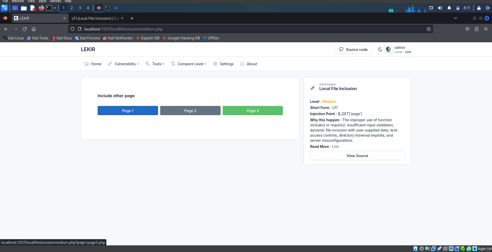

# What is a Local File Inclusion (LFI) vulnerability?
Local File Inclusion (LFI) is a type of vulnerability found in web applications where an attacker can manipulate a web application's file inclusion functionality to include files from the server's local filesystem.
  
The following is an example of PHP code vulnerable to local file inclusion:

In this write-up we will go through on how to exploit LFI vulnerability.

# Identifying Vulnerabilities
This will be our target site for LFI attack.

This site looks normal right? But if we take a look closely, there are 3 buttons and each button has its own page number. If we try to click any of the buttons, we will notice that in the url, there are something that has been added.

